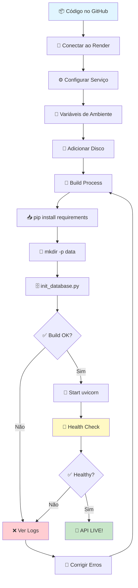

# 🎨 Guia Visual de Deploy no Render

## 🗺️ Visão Geral do Processo

```
┌─────────────────────────────────────────────────────────────────┐
│                     PROCESSO DE DEPLOY                          │
└─────────────────────────────────────────────────────────────────┘

1️⃣  GitHub         2️⃣  Render          3️⃣  Build          4️⃣  Deploy
    📦              🔗                 🔨                 🚀
    Código     →    Conecta      →    Instala      →    API LIVE
    Commits         Repositório       Dependências       Online!
```

## 📊 Fluxo Completo de Deploy



## 🎯 Estados da API no Render

```
┌─────────────────────────────────────────────────────────────┐
│                    ESTADOS DO DEPLOY                        │
├─────────────────────────────────────────────────────────────┤
│                                                             │
│  🔵 Building      →  Instalando dependências               │
│                      Executando scripts                     │
│                      Criando banco de dados                 │
│                                                             │
│  🟡 Deploying     →  Iniciando servidor                     │
│                      Rodando health checks                  │
│                                                             │
│  🟢 Live          →  API funcionando                        │
│                      Aceitando requisições                  │
│                      Tudo OK! ✅                            │
│                                                             │
│  🔴 Failed        →  Erro no build/deploy                   │
│                      Verificar logs                         │
│                      Corrigir e tentar novamente            │
│                                                             │
└─────────────────────────────────────────────────────────────┘
```

## 🔐 Variáveis de Ambiente - Visualização

```
┌─────────────────────────────────────────────────────────────┐
│               VARIÁVEIS DE AMBIENTE                         │
├─────────────────────────────────────────────────────────────┤
│                                                             │
│  🔹 APP_NAME                 = book-recommendation-api      │
│  🔹 APP_VERSION              = 1.0.0                        │
│  🔹 ENVIRONMENT              = production                   │
│  🔹 DEBUG                    = False                        │
│  🔹 DATABASE_URL             = sqlite:///./data/books.db    │
│  🔐 SECRET_KEY               = [AUTO-GERADO] 🔒             │
│  🔹 ALGORITHM                = HS256                        │
│  🔹 ACCESS_TOKEN_EXPIRE_MIN  = 30                           │
│  🔹 REFRESH_TOKEN_EXPIRE_DAY = 7                            │
│  🔹 ALLOWED_ORIGINS          = ["*"]                        │
│  🔹 ADMIN_USERNAME           = admin                        │
│  🔹 ADMIN_EMAIL              = admin@bookapi.com            │
│  🔐 ADMIN_PASSWORD           = [CONFIGURE VOCÊ] 🔒          │
│                                                             │
│  ⚠️  CRÍTICO: Marque SECRET_KEY e ADMIN_PASSWORD como      │
│      "Secret" no Render Dashboard!                          │
│                                                             │
└─────────────────────────────────────────────────────────────┘
```

## 💾 Estrutura do Disco Persistente

```
Render Server
│
├── /opt/render/project/src/          ← Código da aplicação
│   ├── app/                           ← FastAPI app
│   │   ├── api/
│   │   ├── models/
│   │   ├── schemas/
│   │   └── main.py
│   │
│   ├── data/                          ← 💾 DISCO PERSISTENTE
│   │   ├── books.csv                  ← 1000 livros (147KB)
│   │   └── books.db                   ← SQLite database
│   │
│   ├── scripts/
│   │   └── init_database.py           ← Script de inicialização
│   │
│   └── requirements.txt
│
└── [disk mounted at /opt/render/project/src/data]
    ↑
    💾 1GB Persistent Disk
    └── Dados NÃO são perdidos entre deploys!
```

## 🏗️ Build Process Detalhado

```
┌─────────────────────────────────────────────────────────────┐
│                    BUILD COMMAND                            │
├─────────────────────────────────────────────────────────────┤
│                                                             │
│  1️⃣  pip install -r requirements.txt                       │
│      │                                                      │
│      ├─ fastapi         ✅                                  │
│      ├─ uvicorn         ✅                                  │
│      ├─ sqlalchemy      ✅                                  │
│      ├─ pydantic        ✅                                  │
│      ├─ python-jose     ✅                                  │
│      ├─ passlib         ✅                                  │
│      └─ ... (mais 14)   ✅                                  │
│                                                             │
│  2️⃣  mkdir -p data                                         │
│      │                                                      │
│      └─ Cria diretório de dados ✅                          │
│                                                             │
│  3️⃣  python scripts/init_database.py                       │
│      │                                                      │
│      ├─ 📁 Cria diretório data/                            │
│      ├─ 🗄️ Cria tabelas: books, users, api_logs            │
│      ├─ 📚 Importa 1000 livros do CSV                       │
│      ├─ 👤 Cria usuário admin                               │
│      └─ ✅ Verificação final                                │
│                                                             │
│  ✅ BUILD COMPLETO - Pronto para iniciar!                   │
│                                                             │
└─────────────────────────────────────────────────────────────┘
```

## 🚀 Start Process

```
┌─────────────────────────────────────────────────────────────┐
│                    START COMMAND                            │
├─────────────────────────────────────────────────────────────┤
│                                                             │
│  uvicorn app.main:app --host 0.0.0.0 --port $PORT          │
│           │      │      │             │                     │
│           │      │      │             └─ Porta do Render   │
│           │      │      └─ Aceita todas as conexões        │
│           │      └─ Instância FastAPI                      │
│           └─ Módulo principal                              │
│                                                             │
│  📡 Servidor iniciado em: http://0.0.0.0:10000              │
│  🌍 Público em: https://seu-app.onrender.com                │
│  📚 Docs em: https://seu-app.onrender.com/docs              │
│                                                             │
└─────────────────────────────────────────────────────────────┘
```

## 🏥 Health Check

```
┌─────────────────────────────────────────────────────────────┐
│                    HEALTH CHECK                             │
├─────────────────────────────────────────────────────────────┤
│                                                             │
│  Render verifica a cada 30 segundos:                       │
│                                                             │
│  GET https://seu-app.onrender.com/api/v1/health            │
│       ↓                                                     │
│  ┌─────────────────────────────────────┐                   │
│  │  {                                  │                   │
│  │    "status": "saudável",            │  ← ✅ OK         │
│  │    "app_name": "book-...",          │                   │
│  │    "version": "1.0.0",              │                   │
│  │    "environment": "production",     │                   │
│  │    "database": "conectado"          │  ← ✅ DB OK      │
│  │  }                                  │                   │
│  └─────────────────────────────────────┘                   │
│                                                             │
│  Status Code: 200 ✅                                        │
│  Response Time: < 1s ✅                                     │
│                                                             │
│  → API está HEALTHY! 🟢                                     │
│                                                             │
└─────────────────────────────────────────────────────────────┘
```

## 📊 Endpoints da API

```
┌─────────────────────────────────────────────────────────────┐
│                    API ENDPOINTS                            │
├─────────────────────────────────────────────────────────────┤
│                                                             │
│  🏥 Health & Docs                                           │
│     GET  /api/v1/health               ← Health check       │
│     GET  /docs                        ← Swagger UI         │
│     GET  /redoc                       ← ReDoc             │
│                                                             │
│  📚 Books                                                   │
│     GET  /api/v1/books                ← Lista (paginado)   │
│     GET  /api/v1/books/{id}           ← Por ID            │
│     GET  /api/v1/books/search         ← Busca             │
│     GET  /api/v1/books/top-rated      ← Top rated         │
│     GET  /api/v1/books/price-range    ← Por preço         │
│                                                             │
│  📂 Categories                                              │
│     GET  /api/v1/categories           ← Lista todas       │
│                                                             │
│  📊 Statistics                                              │
│     GET  /api/v1/stats/overview       ← Visão geral       │
│     GET  /api/v1/stats/categories     ← Por categoria     │
│                                                             │
│  🔐 Authentication                                          │
│     POST /api/v1/auth/login           ← Login             │
│     POST /api/v1/auth/refresh         ← Refresh token     │
│     GET  /api/v1/auth/me              ← User info         │
│                                                             │
│  🛡️ Admin (Requer autenticação)                            │
│     POST /api/v1/scraping/trigger     ← 🔒 Admin only     │
│     GET  /api/v1/scraping/status      ← 🔒 Admin only     │
│                                                             │
│  🤖 ML Pipeline                                             │
│     GET  /api/v1/ml/features          ← Features ML       │
│     GET  /api/v1/ml/training-data     ← Training data     │
│     POST /api/v1/ml/predictions       ← Predictions       │
│                                                             │
│  Total: 15 endpoints funcionais ✅                          │
│                                                             │
└─────────────────────────────────────────────────────────────┘
```

## 🧪 Teste Rápido (Copy & Paste)

```bash
# ========================================
# TESTES RÁPIDOS - COPIE E COLE
# ========================================

# Substitua SEU-APP pelo nome do seu app no Render
export API_URL="https://SEU-APP.onrender.com"

# 1. Health Check
echo "🏥 Testing Health Check..."
curl $API_URL/api/v1/health

# 2. Listar Livros
echo "\n📚 Testing Books List..."
curl "$API_URL/api/v1/books?page=1&page_size=5"

# 3. Buscar por ID
echo "\n🔍 Testing Book by ID..."
curl $API_URL/api/v1/books/1

# 4. Categorias
echo "\n📂 Testing Categories..."
curl $API_URL/api/v1/categories

# 5. Estatísticas
echo "\n📊 Testing Stats..."
curl $API_URL/api/v1/stats/overview

# 6. Login
echo "\n🔐 Testing Authentication..."
curl -X POST "$API_URL/api/v1/auth/login" \
  -H "Content-Type: application/x-www-form-urlencoded" \
  -d "username=admin&password=Admin@123"

# ✅ Se todos retornaram dados, API está funcionando!
```

## 🎯 Resultado Final Esperado

```
┌─────────────────────────────────────────────────────────────┐
│                    ✅ DEPLOY COMPLETO                       │
├─────────────────────────────────────────────────────────────┤
│                                                             │
│  🌍 URL Pública:                                            │
│     https://book-recommendation-api.onrender.com            │
│                                                             │
│  📚 Documentação Swagger:                                   │
│     https://book-recommendation-api.onrender.com/docs       │
│                                                             │
│  📖 ReDoc:                                                  │
│     https://book-recommendation-api.onrender.com/redoc      │
│                                                             │
│  🔐 Autenticação:                                           │
│     Username: admin                                        │
│     Password: Admin@123                                    │
│                                                             │
│  📊 Dados:                                                  │
│     ✅ 1000 livros importados                               │
│     ✅ 50+ categorias                                       │
│     ✅ 3 tabelas criadas                                    │
│     ✅ Admin user criado                                    │
│                                                             │
│  🎉 STATUS: LIVE EM PRODUÇÃO!                               │
│                                                             │
└─────────────────────────────────────────────────────────────┘
```

## 📋 Checklist Visual

```
Deploy no Render - Checklist

Preparação
  ✅ Código no GitHub
  ✅ CSV com 1000 livros
  ✅ Branch atualizada

Configuração no Render
  ✅ Repositório conectado
  ✅ Build command configurado
  ✅ Start command configurado
  ✅ Variáveis de ambiente adicionadas
  ✅ ADMIN_PASSWORD marcado como Secret
  ✅ SECRET_KEY marcado como Secret
  ✅ Disco persistente adicionado (1GB)
  ✅ Health check configurado

Build & Deploy
  ✅ Build iniciado
  ✅ Dependencies instaladas
  ✅ Database inicializado
  ✅ 1000 livros importados
  ✅ Admin user criado
  ✅ Health check passou

Verificação
  ✅ Health endpoint responde 200
  ✅ Swagger docs acessível
  ✅ Autenticação funciona
  ✅ Endpoints retornam dados
  ✅ Logs sem erros

Entrega
  ✅ URL pública obtida
  ✅ Arquivo .txt criado com links
  ✅ Vídeo gravado
  ✅ README atualizado
  ✅ Pronto para entregar!

🎉 DEPLOY COMPLETO!
```

## 🆘 Troubleshooting Visual

```
┌─────────────────────────────────────────────────────────────┐
│                 PROBLEMAS COMUNS                            │
├─────────────────────────────────────────────────────────────┤
│                                                             │
│  ❌ Build Failed                                            │
│     └─ Verificar: requirements.txt, scripts, CSV           │
│     └─ Solução: Clear cache & rebuild                      │
│                                                             │
│  ❌ Health Check Failed                                     │
│     └─ Verificar: porta $PORT, endpoint /api/v1/health     │
│     └─ Solução: Ver logs, verificar main.py                │
│                                                             │
│  ❌ Database Error                                          │
│     └─ Verificar: disco persistente configurado            │
│     └─ Solução: Adicionar disk, fazer rebuild              │
│                                                             │
│  ❌ 503 Service Unavailable                                 │
│     └─ Causa: App está acordando (free tier)               │
│     └─ Solução: Aguardar 30-60s na primeira request        │
│                                                             │
│  ❌ Autenticação falha                                      │
│     └─ Verificar: ADMIN_PASSWORD configurado               │
│     └─ Solução: Adicionar variável, rebuild                │
│                                                             │
└─────────────────────────────────────────────────────────────┘
```

---

**Este guia visual complementa o [DEPLOY_RENDER_QUICKSTART.md](DEPLOY_RENDER_QUICKSTART.md)**

🚀 **Siga o quickstart para instruções passo a passo!**
