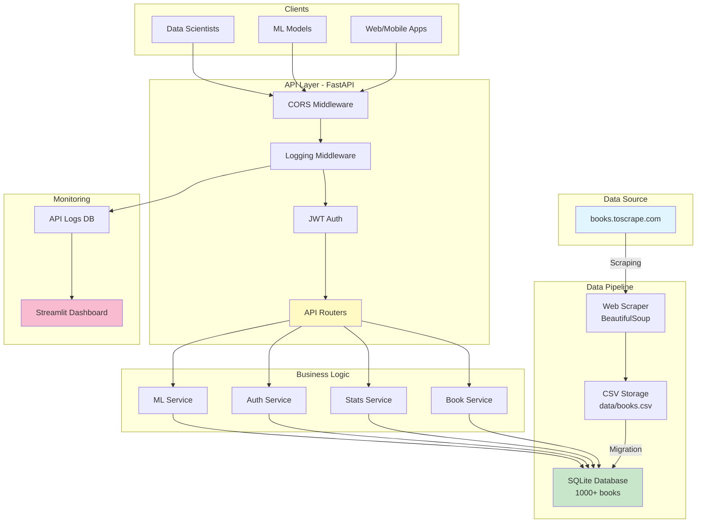

# 📚 Book Recommendation API

> **Tech Challenge - Fase 1: Machine Learning Engineering**
> FIAP Pós Tech - Sistema completo de API RESTful para recomendação de livros

[](https://fastapi.tiangolo.com/)
[](https://python.org)
[](https://sqlite.org)
[](LICENSE)

## 🎯 Sobre o Projeto

API pública para consulta e recomendação de livros, desenvolvida como parte do Tech Challenge da FIAP. O projeto implementa um pipeline completo de dados desde web scraping até endpoints ML-ready, com autenticação JWT, monitoramento em tempo real e deploy em produção.

### 📊 Status do Projeto

- ✅ **15 Endpoints funcionais** (100% dos requisitos + extras)
- ✅ **3/3 Desafios Bônus implementados**
- ✅ **1000 livros** no banco de dados
- ✅ **Swagger/OpenAPI** documentação automática
- ✅ **Testes** automatizados
- ⏳ **Deploy** em produção (Render)

---

## 🚀 Features Implementadas

### Core Features (Obrigatórias)
- [x] Web scraping automatizado (books.toscrape.com)
- [x] Armazenamento em SQLite com 1000+ livros
- [x] API RESTful com FastAPI
- [x] 5 endpoints core + 4 endpoints de insights
- [x] Documentação Swagger automática
- [x] Deploy em nuvem (Render)

### 🏆 Desafio 1: Sistema de Autenticação JWT
- [x] Login com OAuth2 (username/password)
- [x] Access tokens (30 min) e Refresh tokens (7 dias)
- [x] Proteção de rotas admin-only
- [x] Trigger do scraper protegido
- [x] Gerenciamento de usuários

### 🤖 Desafio 2: Pipeline ML-Ready
- [x] Features engenheiradas para ML (normalização, encoding)
- [x] Export de dados para treinamento (JSON/CSV)
- [x] Endpoint para receber predições de modelos
- [x] Integração completa com workflows ML

### 📊 Desafio 3: Monitoramento & Analytics
- [x] Logging automático de todas as requisições
- [x] Middleware de performance tracking
- [x] Dashboard Streamlit em tempo real
- [x] Métricas: requests, response time, error rate
- [x] Visualizações interativas (Plotly)

---

## 📋 Endpoints da API

### Health Check
- `GET /api/v1/health` - Status da API e conectividade do banco

### 📚 Books (Livros)
- `GET /api/v1/books` - Lista todos os livros (paginado)
- `GET /api/v1/books/{id}` - Busca livro por ID
- `GET /api/v1/books/search?title={title}&category={category}` - Busca por título/categoria
- `GET /api/v1/books/top-rated?limit=10` - Livros mais bem avaliados
- `GET /api/v1/books/price-range?min=0&max=50` - Filtro por faixa de preço

### 📂 Categories (Categorias)
- `GET /api/v1/categories` - Lista todas as categorias com contagem

### 📊 Statistics (Estatísticas)
- `GET /api/v1/stats/overview` - Estatísticas gerais (total, média, distribuição)
- `GET /api/v1/stats/categories` - Estatísticas detalhadas por categoria

### 🔐 Authentication (Autenticação)
- `POST /api/v1/auth/login` - Login (retorna access + refresh tokens)
- `POST /api/v1/auth/refresh` - Renovar access token
- `GET /api/v1/auth/me` - Informações do usuário autenticado

### 🛡️ Admin (Administrativo)
- `POST /api/v1/scraping/trigger` - Executar scraper 🔒 *admin only*
- `GET /api/v1/scraping/status` - Status do scraper 🔒 *admin only*

### 🤖 ML Pipeline (Machine Learning)
- `GET /api/v1/ml/features?limit=1000` - Features engenheiradas para ML
- `GET /api/v1/ml/training-data?format=json` - Dataset para treinamento
- `POST /api/v1/ml/predictions` - Submeter predições de modelos

---

## 🏗️ Arquitetura



### 📁 Estrutura do Projeto

```
book-api/
├── app/                        # Aplicação principal
│   ├── api/v1/                # Endpoints da API
│   │   ├── auth.py           # Autenticação
│   │   ├── books.py          # Livros
│   │   ├── categories.py     # Categorias
│   │   ├── health.py         # Health check
│   │   ├── ml.py             # ML pipeline
│   │   ├── scraping.py       # Admin scraper
│   │   └── stats.py          # Estatísticas
│   ├── models/               # Modelos SQLAlchemy
│   │   ├── book.py
│   │   ├── user.py
│   │   └── api_log.py
│   ├── schemas/              # Schemas Pydantic
│   │   ├── auth.py
│   │   ├── book.py
│   │   ├── ml.py
│   │   └── stats.py
│   ├── services/             # Lógica de negócio
│   │   ├── auth_service.py
│   │   ├── book_service.py
│   │   ├── ml_service.py
│   │   └── stats_service.py
│   ├── utils/                # Utilidades
│   │   ├── middleware.py     # Logging middleware
│   │   └── security.py       # JWT e senha
│   ├── config.py             # Configurações
│   ├── database.py           # SQLAlchemy setup
│   └── main.py               # FastAPI app
├── scripts/                   # Scripts utilitários
│   ├── scraping.py           # Web scraper
│   ├── migrate_csv_to_db.py  # Migração CSV→SQLite
│   └── create_admin_user.py  # Criar usuário admin
├── monitoring/                # Monitoramento
│   ├── dashboard.py          # Dashboard Streamlit
│   └── requirements.txt
├── data/                      # Dados
│   ├── books.csv             # CSV original (1000 livros)
│   └── books.db              # Banco SQLite
├── tests/                     # Testes
│   ├── test_books.py
│   ├── test_auth.py
│   └── conftest.py
├── .env                       # Variáveis de ambiente
├── requirements.txt           # Dependências Python
├── Procfile                   # Deploy Render
├── render.yaml                # Configuração Render
└── README.md                  # Este arquivo
```

---

## 🛠️ Instalação e Configuração

### Pré-requisitos

- Python 3.10+
- pip
- Git

### 1️⃣ Clone o Repositório

```bash
git clone https://github.com/GabrielPLeite/book-api.git
cd book-api
```

### 2️⃣ Crie um Ambiente Virtual

```bash
python -m venv venv
source venv/bin/activate  # Linux/Mac
# ou
venv\Scripts\activate  # Windows
```

### 3️⃣ Instale as Dependências

```bash
pip install -r requirements.txt
```

### 4️⃣ Configure as Variáveis de Ambiente

```bash
cp .env.example .env
# Edite o .env com suas configurações
```

**Variáveis importantes:**
```env
APP_NAME=book-recommendation-api
APP_VERSION=1.0.0
ENVIRONMENT=development
DEBUG=True
DATABASE_URL=sqlite:///./data/books.db
SECRET_KEY=super-secret-key-change-in-production-12345
ADMIN_USERNAME=admin
ADMIN_PASSWORD=Admin@123
```

### 5️⃣ Execute a Migração do Banco de Dados

```bash
python scripts/migrate_csv_to_db.py
```

Saída esperada:
```
✅ Successfully read 1000 books from CSV
✅ Database tables created successfully
✅ Successfully inserted 1000 books into database
📊 Total books in database: 1000
```

### 6️⃣ Crie o Usuário Admin

```bash
python scripts/create_admin_user.py
```

Saída esperada:
```
✅ Admin user created successfully!
Username: admin
Password: Admin@123
```

### 7️⃣ Inicie o Servidor

```bash
uvicorn app.main:app --reload --host 0.0.0.0 --port 8000
```

### 8️⃣ Acesse a Documentação

Abra seu navegador em:
- **Swagger UI**: http://localhost:8000/docs
- **ReDoc**: http://localhost:8000/redoc
- **API Root**: http://localhost:8000/

---

## 📖 Exemplos de Uso

### Usando cURL

#### 1. Health Check
```bash
curl http://localhost:8000/api/v1/health
```

#### 2. Listar Livros (Paginado)
```bash
curl "http://localhost:8000/api/v1/books?page=1&page_size=10"
```

#### 3. Buscar Livro por ID
```bash
curl http://localhost:8000/api/v1/books/5
```

#### 4. Buscar por Título
```bash
curl "http://localhost:8000/api/v1/books/search?title=light"
```

#### 5. Login (Obter Token JWT)
```bash
curl -X POST http://localhost:8000/api/v1/auth/login \
  -H "Content-Type: application/x-www-form-urlencoded" \
  -d "username=admin&password=Admin@123"
```

Resposta:
```json
{
  "access_token": "eyJhbGciOiJIUzI1NiIs...",
  "refresh_token": "eyJhbGciOiJIUzI1NiIs...",
  "token_type": "bearer"
}
```

#### 6. Usar Token JWT para Endpoint Protegido
```bash
TOKEN="your_access_token_here"

curl -X POST http://localhost:8000/api/v1/scraping/trigger \
  -H "Authorization: Bearer $TOKEN"
```

#### 7. ML Features
```bash
curl "http://localhost:8000/api/v1/ml/features?limit=5"
```

### Usando Python (requests)

```python
import requests

# Base URL
BASE_URL = "http://localhost:8000/api/v1"

# 1. Listar livros
response = requests.get(f"{BASE_URL}/books", params={"page": 1, "page_size": 20})
books = response.json()
print(f"Total de livros: {books['total']}")

# 2. Login
login_data = {
    "username": "admin",
    "password": "Admin@123"
}
response = requests.post(f"{BASE_URL}/auth/login", data=login_data)
tokens = response.json()
access_token = tokens["access_token"]

# 3. Usar token para endpoint protegido
headers = {"Authorization": f"Bearer {access_token}"}
response = requests.get(f"{BASE_URL}/auth/me", headers=headers)
user_info = response.json()
print(f"Usuário autenticado: {user_info['username']}")

# 4. Obter features ML
response = requests.get(f"{BASE_URL}/ml/features", params={"limit": 100})
ml_data = response.json()
print(f"Features disponíveis: {len(ml_data['feature_names'])}")

# 5. Submeter predições
predictions = {
    "model_name": "collaborative_filtering_v1",
    "predictions": [
        {"book_id": 1, "prediction_score": 0.85, "model_version": "1.0.0"},
        {"book_id": 2, "prediction_score": 0.72, "model_version": "1.0.0"}
    ]
}
response = requests.post(f"{BASE_URL}/ml/predictions", json=predictions)
result = response.json()
print(f"Predições recebidas: {result['predictions_received']}")
```

---

## 📊 Monitoramento

### Dashboard Streamlit

O projeto inclui um dashboard interativo em tempo real construído com Streamlit e Plotly para monitorar o desempenho e uso da API.

#### 🚀 Iniciar o Dashboard

**Opção 1: Usando o script de inicialização (recomendado)**
```bash
./run_dashboard.sh
```

**Opção 2: Manualmente**
```bash
streamlit run monitoring/dashboard.py
```

**Opção 3: Instalação independente**
```bash
cd monitoring
pip install -r requirements.txt
streamlit run dashboard.py
```

#### 📱 Acessar o Dashboard

Abra seu navegador em: **http://localhost:8501**

#### 📊 Métricas Disponíveis

O dashboard exibe em tempo real:

**KPIs Principais:**
- 📈 **Total de Requisições** - Número total com delta da última hora
- ⚡ **Tempo Médio de Resposta** - Média e percentil P95 em milissegundos
- ⚠️ **Taxa de Erro** - Porcentagem de erros HTTP 4xx/5xx
- 📚 **Estatísticas de Livros** - Total de livros e categorias

**Visualizações Gráficas:**
- 📊 **Requisições ao Longo do Tempo** - Gráfico de linha com agregação horária
- 🎯 **Top 10 Endpoints** - Gráfico de barras dos endpoints mais acessados
- ⚡ **Distribuição de Tempo de Resposta** - Histograma de performance
- 📊 **Códigos HTTP** - Gráfico de pizza com distribuição de status codes
- 📋 **Requisições Recentes** - Tabela com as últimas 20 requisições

**Funcionalidades:**
- 🔄 Botão de refresh manual
- ⏱️ Filtros de tempo: última hora, 6h, 24h, 7 dias, todo período
- 🎨 Coloração automática de status codes (verde=2xx, amarelo=4xx, vermelho=5xx)
- 📊 Auto-refresh a cada 30 segundos
- 📱 Layout responsivo otimizado para desktop

#### ⚙️ Configuração

O dashboard utiliza as mesmas variáveis de ambiente do arquivo `.env`:
- `DATABASE_URL` - Conexão com o banco SQLite
- Carregamento automático via `python-dotenv`

**Nota:** Certifique-se de que a API está rodando e gerando logs para ver dados no dashboard.

---

## 🧪 Testes

### Executar Todos os Testes

```bash
pytest tests/ -v --cov=app --cov-report=html
```

### Executar Testes Específicos

```bash
# Apenas testes de livros
pytest tests/test_books.py -v

# Apenas testes de autenticação
pytest tests/test_auth.py -v
```

### Cobertura de Testes

Após executar os testes com coverage, abra o relatório:
```bash
open htmlcov/index.html  # Mac/Linux
# ou
start htmlcov/index.html # Windows
```

---

## 🚀 Deploy no Render

### 📚 Guias de Deploy Completos

Este projeto inclui **3 guias detalhados** para facilitar seu deploy no Render:

1. **[DEPLOY_RENDER_QUICKSTART.md](DEPLOY_RENDER_QUICKSTART.md)** ⚡
   - Guia rápido passo a passo
   - Ideal para quem quer deploy em menos de 10 minutos
   - Instruções diretas e objetivas

2. **[DEPLOY_VISUAL_GUIDE.md](DEPLOY_VISUAL_GUIDE.md)** 🎨
   - Diagramas e visualizações
   - Fluxogramas do processo de deploy
   - Entenda visualmente cada etapa

3. **[DEPLOY_CHECKLIST.md](DEPLOY_CHECKLIST.md)** ✅
   - Checklist interativo
   - Marque cada item conforme completa
   - Não esqueça nenhuma etapa importante

### ⚡ Resumo Rápido

#### Pré-requisitos
- ✅ Conta no [Render.com](https://dashboard.render.com)
- ✅ Repositório no GitHub
- ✅ Arquivo `data/books.csv` no repositório (1000 livros)

#### Deploy em 5 Passos

1. **Conectar Repositório**
   - Render Dashboard → New + → Web Service
   - Conectar conta GitHub
   - Selecionar repositório

2. **Configurar Build**
   ```bash
   pip install -r requirements.txt && mkdir -p data && python scripts/init_database.py
   ```

3. **Configurar Start**
   ```bash
   uvicorn app.main:app --host 0.0.0.0 --port $PORT
   ```

4. **Adicionar Variáveis de Ambiente**
   - Copie do `.env.example` ou use o [guia de deploy](DEPLOY_RENDER_QUICKSTART.md)
   - **CRÍTICO**: Configure `ADMIN_PASSWORD` como Secret

5. **Adicionar Disco Persistente**
   - Name: `data-disk`
   - Mount Path: `/opt/render/project/src/data`
   - Size: 1GB

#### Verificação Pós-Deploy

```bash
# Health Check
curl https://seu-app.onrender.com/api/v1/health

# Swagger Docs
open https://seu-app.onrender.com/docs

# Listar Livros
curl https://seu-app.onrender.com/api/v1/books
```

### 📝 Arquivos de Deploy

**Procfile**:
```
web: uvicorn app.main:app --host 0.0.0.0 --port $PORT
```

**render.yaml**:
```yaml
services:
  - type: web
    name: book-api
    env: python
    region: oregon
    plan: free
    branch: feat-adding-api
    buildCommand: |
      pip install -r requirements.txt
      python scripts/migrate_csv_to_db.py
      python scripts/create_admin_user.py
    startCommand: uvicorn app.main:app --host 0.0.0.0 --port $PORT
    healthCheckPath: /api/v1/health
    envVars:
      - key: ENVIRONMENT
        value: production
      - key: SECRET_KEY
        generateValue: true
    disk:
      name: data-disk
      mountPath: /opt/render/project/src/data
      sizeGB: 1
```

### Passos para Deploy

1. **Push para GitHub**:
```bash
git add .
git commit -m "feat: Prepare for Render deployment"
git push origin feat-adding-api
```

2. **Criar Web Service no Render**:
   - Acesse https://dashboard.render.com/
   - Clique em "New" → "Web Service"
   - Conecte seu repositório GitHub
   - Selecione o branch `feat-adding-api`
   - Render detectará automaticamente o `render.yaml`

3. **Configurar Variáveis de Ambiente**:
   - `SECRET_KEY`: Gere uma chave aleatória
   - `ADMIN_PASSWORD`: Senha do admin
   - `ALLOWED_ORIGINS`: Domínios permitidos (ou "*")

4. **Deploy**: Clique em "Create Web Service"

5. **Verificar**: Após o deploy:
   - Health check: `https://your-app.onrender.com/api/v1/health`
   - Swagger: `https://your-app.onrender.com/docs`

---

## 📊 Dados

### Schema do Banco de Dados

**Tabela: books**
| Coluna | Tipo | Descrição |
|--------|------|-----------|
| id | INTEGER | ID único (1-1000) |
| title | VARCHAR(500) | Título do livro |
| price | FLOAT | Preço em GBP |
| rating | INTEGER | Avaliação (1-5 estrelas) |
| availability | INTEGER | Quantidade em estoque |
| category | VARCHAR(100) | Categoria |
| image_url | VARCHAR(1000) | URL da imagem |

**Índices**:
- `idx_category_rating` (category, rating)
- `idx_price_rating` (price, rating)

**Estatísticas**:
- **Total de livros**: 1000
- **Categorias**: 50
- **Faixa de preço**: £10.00 - £59.99
- **Distribuição de ratings**: Balanceada (1-5)

---

## 🛠️ Tecnologias Utilizadas

### Backend
- **FastAPI** 0.104.1 - Framework web moderno e rápido
- **SQLAlchemy** 2.0.23 - ORM para Python
- **Pydantic** 2.5.0 - Validação de dados
- **Python-Jose** 3.3.0 - JWT tokens
- **Passlib** 1.7.4 - Hash de senhas (bcrypt)

### Data & ML
- **Pandas** 2.1.3 - Manipulação de dados
- **BeautifulSoup4** 4.12.2 - Web scraping
- **Requests** 2.31.0 - HTTP client

### Monitoring
- **Streamlit** 1.29.0 - Dashboard interativo
- **Plotly** 5.18.0 - Visualizações

### Database
- **SQLite** - Banco de dados leve e eficiente

### Testing
- **Pytest** 7.4.3 - Framework de testes
- **HTTPx** 0.25.2 - Cliente HTTP para testes

---

## 👥 Contribuindo

Contribuições são bem-vindas! Por favor:

1. Fork o projeto
2. Crie uma branch para sua feature (`git checkout -b feature/AmazingFeature`)
3. Commit suas mudanças (`git commit -m 'Add some AmazingFeature'`)
4. Push para a branch (`git push origin feature/AmazingFeature`)
5. Abra um Pull Request

---

## 📝 Licença

Este projeto está sob a licença MIT. Veja o arquivo [LICENSE](LICENSE) para mais detalhes.

---

## 👨‍💻 Autor

**Gabriel de Paula Leite**

- GitHub: [@GabrielPLeite](https://github.com/GabrielPLeite)
- LinkedIn: [Gabriel de Paula Leite](https://linkedin.com/in/gabriel-de-paula-leite)

---

## 📞 Suporte

Para questões e suporte:
- 📧 Email: admin@example.com
- 🐛 Issues: [GitHub Issues](https://github.com/GabrielPLeite/book-api/issues)
- 📖 Docs: [Swagger UI](http://localhost:8000/docs)

---

## 🙏 Agradecimentos

- FIAP Pós Tech - Machine Learning Engineering
- Books to Scrape - Fonte dos dados
- FastAPI Community

---

**Desenvolvido com ❤️ para o Tech Challenge - FIAP 2025**
